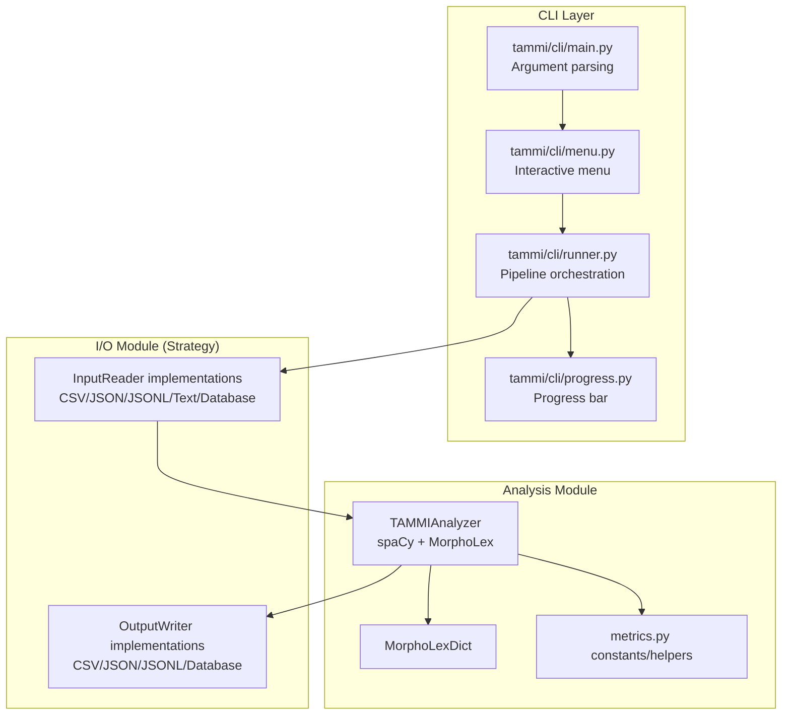
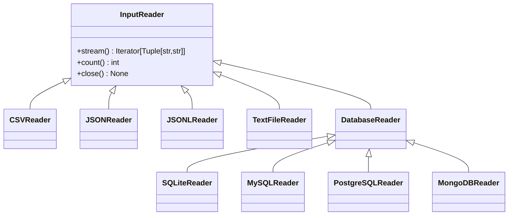
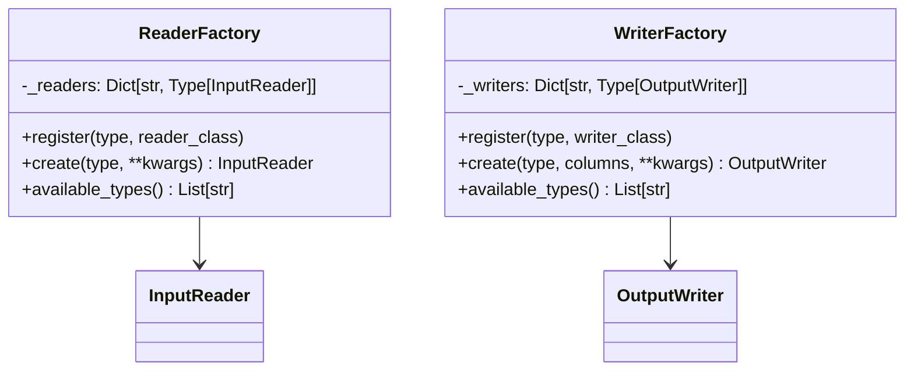
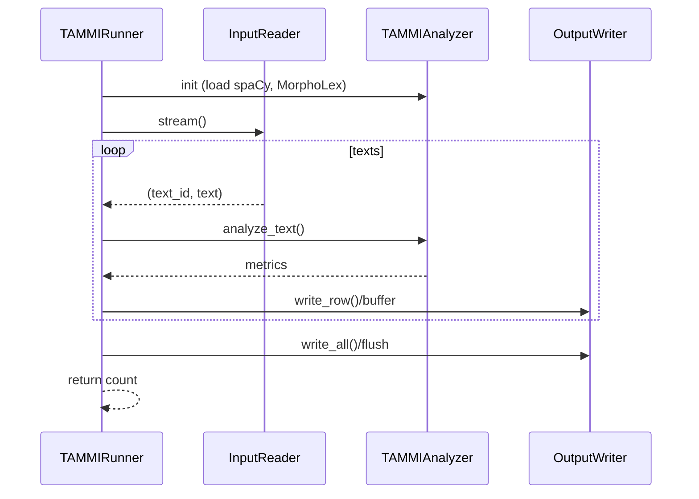
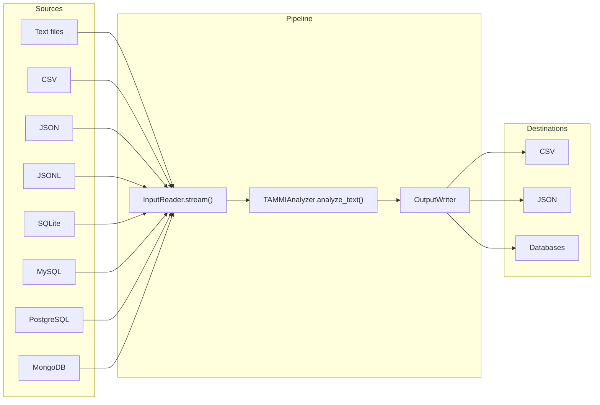
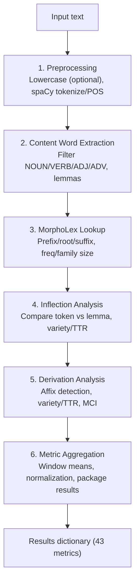
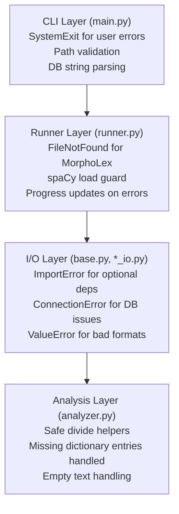

# TAMMI Architecture Overview

## Design Philosophy

TAMMI v2.0 was refactored with the following goals:

- **Modularity**: Separate concerns into distinct modules
- **Extensibility**: Easy to add new input/output formats
- **Testability**: Comprehensive unit test coverage
- **Maintainability**: Clear interfaces and documentation

## Architecture Diagram



## Design Patterns Used

### 1. Strategy Pattern (I/O Module)

The Strategy Pattern allows interchangeable algorithms (I/O formats) at runtime.



### 2. Factory Pattern (Reader/Writer Creation)



### 3. Template Method Pattern (Analysis Pipeline)



## Module Dependencies

```mermaid
flowchart TD
    tammi["tammi/__init__.py"] --> analysis_init["analysis/__init__.py"]
    tammi --> cli_init["cli/__init__.py"]
    tammi --> io_init["io/__init__.py"]

    subgraph Analysis
        analyzer["analyzer.py<br/>spaCy + metrics + morpholex"]
        morpholex["morpholex.py<br/>csv"]
        metrics_mod["metrics.py<br/>constants/helpers"]
    end

    subgraph CLI
        main_cli["main.py<br/>argparse + I/O factories + progress + menu + runner"]
        menu_cli["menu.py<br/>io.base + analysis.metrics"]
        progress_cli["progress.py<br/>spacy/time/os"]
        runner_cli["runner.py<br/>analysis.analyzer + io.base + progress"]
    end

    subgraph IO
        base_io["base.py<br/>abc/dataclasses/typing"]
        csv_io["csv_io.py<br/>csv + base"]
        json_io["json_io.py<br/>json + base"]
        file_io["file_io.py<br/>pathlib + base"]
        db_io["database_io.py<br/>sqlite3/mysql?/psycopg2?/pymongo?"]
    end

    analysis_init --> analyzer
    analysis_init --> morpholex
    analysis_init --> metrics_mod

    cli_init --> main_cli
    cli_init --> menu_cli
    cli_init --> progress_cli
    cli_init --> runner_cli

    io_init --> base_io
    io_init --> csv_io
    io_init --> json_io
    io_init --> file_io
    io_init --> db_io
```



## Data Flow

### Input Processing Flow



### Analysis Pipeline Detail



## Error Handling Strategy



## Extension Points

### Adding a New Input Format

1. Create a new reader class implementing `InputReader`:

```python
# tammi/io/xml_io.py
from tammi.io.base import InputReader, ReaderFactory

class XMLReader(InputReader):
    def __init__(self, path: str, text_xpath: str, id_xpath: str, lowercase: bool = True):
        self.path = path
        self.text_xpath = text_xpath
        self.id_xpath = id_xpath
        self.lowercase = lowercase
    
    def stream(self) -> Iterator[Tuple[str, str]]:
        # Implementation here
        pass
    
    def count(self) -> int:
        # Implementation here
        pass
    
    def close(self) -> None:
        pass

# Register with factory
ReaderFactory.register("xml", XMLReader)
```

1. Add CLI argument in `main.py`:

```python
parser.add_argument("--input-xml", metavar="XML_PATH", help="...")
```

### Adding a New Output Format

Similar process - implement `OutputWriter` and register with `WriterFactory`.

### Adding New Metrics

1. Add constants to `metrics.py`
2. Implement calculation in `analyzer.py`
3. Add column name to `COLUMN_NAMES` list
